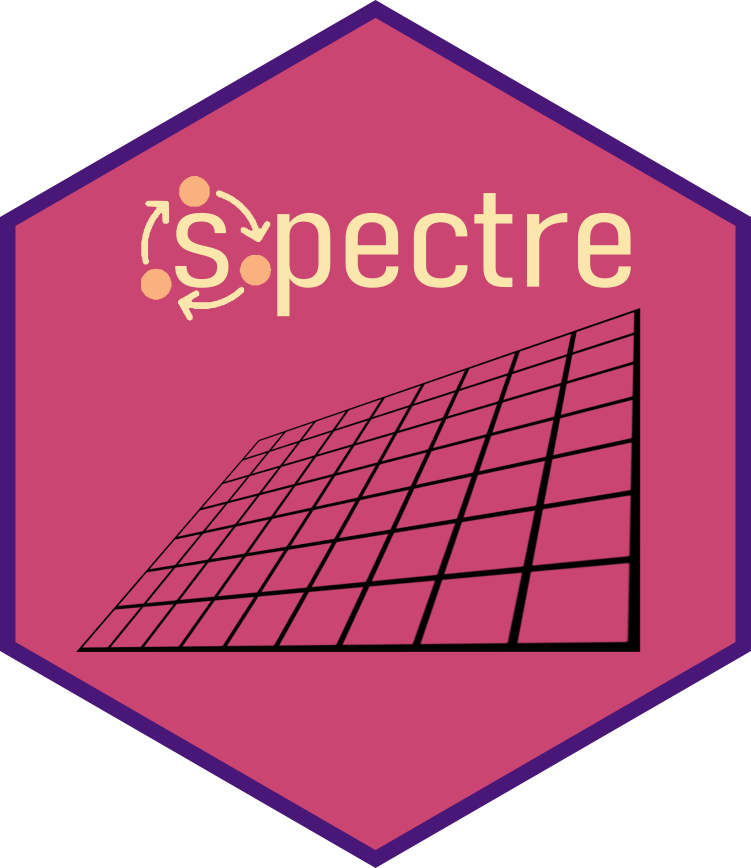

<!-- README.md is generated from README.Rmd. Please edit that file -->

```{r, include = FALSE}
knitr::opts_chunk$set(
  collapse = TRUE,
  comment = "#>",
  fig.path = "man/figures/README-",
  out.width = "100%"
)
```

# spectre </a>

<!-- badges: start -->

| Development | CI | CRAN | License |
|---|---|---|---|
| [](https://www.repostatus.org/#active) | [](https://github.com/r-spatialecology/spectre/actions/workflows/r-cmd-check.yml) | [](https://CRAN.R-project.org/package=spectre) | [](https://www.gnu.org/licenses/gpl-3.0) |
| [](https://lifecycle.r-lib.org/articles/stages.html#stable) | [](https://codecov.io/gh/r-spatialecology/spectre) | [](https://CRAN.R-project.org/package=spectre) | [](https://doi.org/10.1111/ecog.06272) |

<!-- badges: end -->

The goal of `spectre` is to provide an open source tool capable of predicting regional community composition at fine spatial resolutions using only sparse biological and environmental data. 

## Installation

Install the release version from CRAN:

```{r, eval=FALSE}
install.packages("spectre")
```

To install the developmental version of `spectre`, use:

```{r, eval=FALSE}
install.packages("remotes")
remotes::install_github("r-spatialecology/spectre")
```

A full use case example is included in the "Getting started with spectre" vignette associated with the package.

## Meta
- Please [report any issues or bugs](https://github.com/r-spatialecology/spectre/issues/new).
- Get citation information for `spectre` in R doing `citation(package = 'spectre')`

## Code of Conduct

Please note that the **spectre** package is released with a [Contributor Code of Conduct](CODE_OF_CONDUCT.md). By contributing to this project, you agree to abide by its terms.

To see how to contribute to this project, please see the [Contributing guidelines](CONTRIBUTING.md).
