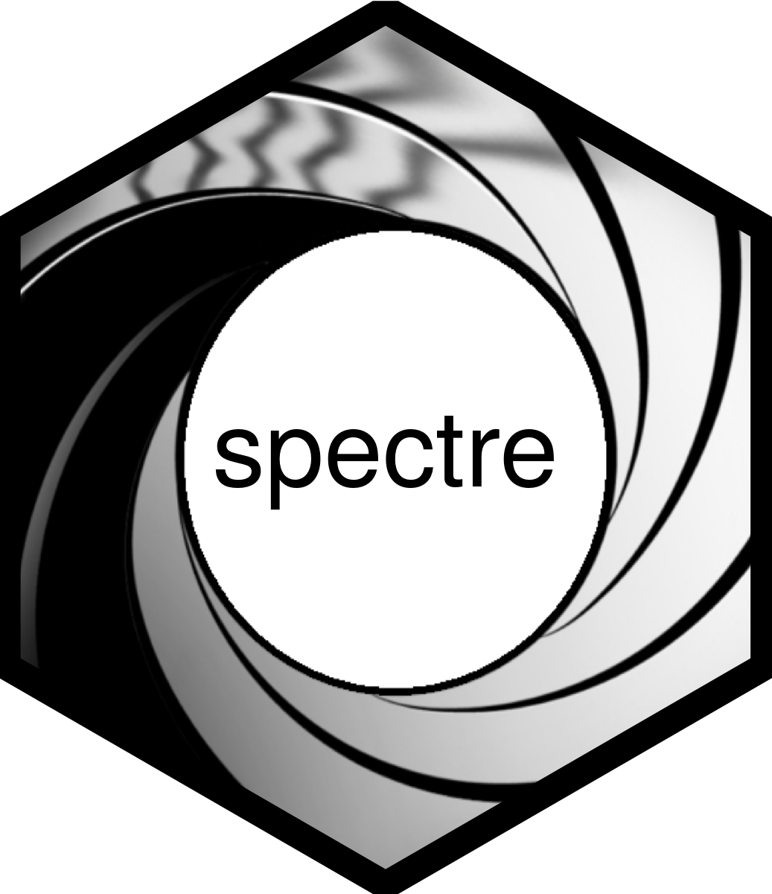

<!-- README.md is generated from README.Rmd. Please edit that file -->

```{r, include = FALSE}
knitr::opts_chunk$set(
  collapse = TRUE,
  comment = "#>",
  fig.path = "man/figures/README-",
  out.width = "100%"
)
```

# spectre



<!-- badges: start -->

[](https://www.repostatus.org/#active)
[](https://www.tidyverse.org/lifecycle/#stable)


[](https://codecov.io/gh/r-spatialecology/spectre?branch=main)

<!-- [](https://CRAN.R-project.org/package=spectre) -->
<!-- [](http://cran.rstudio.com/web/packages/spectre/index.html) -->

[](https://www.gnu.org/licenses/gpl-3.0) 
<!-- badges: end -->

The goal of `spectre` is to provide an open source tool capable of predicting regional community composition at fine spatial resolutions using only sparse biological and environmental data. 

## Installation

Install the release version from CRAN:

```{r, eval=FALSE}
install.packages("spectre") #Uncomment when package is on CRAN
```

To install the developmental version of `spectre`, use:
```{r, eval=FALSE}
install.packages("remotes")
remotes::install_github("r-spatialecology/spectre")
```

## Example

TODO after discussion...

## Meta
- Please [report any issues or bugs](https://github.com/r-spatialecology/spectre/issues/new).
- Get citation information for `NLMR` in R doing `citation(package = 'NLMR')`

## Code of Conduct

Please note that the spectre project is released with a [Contributor Code of Conduct](https://contributor-covenant.org/version/2/0/CODE_OF_CONDUCT.html). By contributing to this project, you agree to abide by its terms.